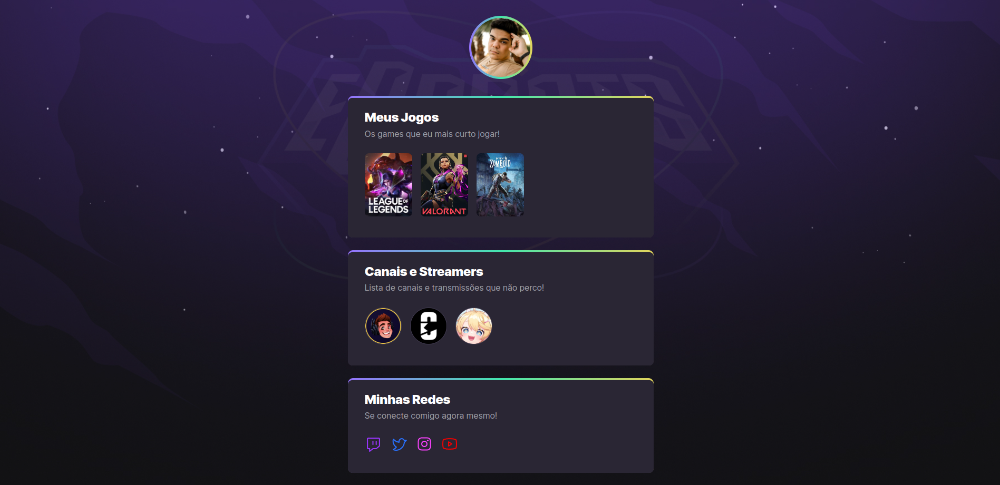

# NLW Together - Origin

Esse é um projeto criado em acompanhamento em vídeo para o NLW Together da [Rocketseat](https://www.rocketseat.com.br/)

## Índice

- [Visão Geral](#Visão-Geral)
  - [O Desafio](#O-Desafio)
  - [Screenshot](#screenshot)
  - [Links](#Links)
- [Meu Processo](#Meu-Processo)
  - [Feito com](#Feito-com)
- [Autor](#autor)

## Visão Geral

### O Desafio

Criar um site, seguindo o layout do figma, com instruções em vídeo da semana NWL eSports - Explorer.

### Screenshot

### Links

- Solution URL: [GitHub](https://github.com/gabrielpedutti/NlwE-Sports-Explorer)
- Live Site URL: [Live Site](https://gabrielpedutti.github.io/NlwE-Sports-Explorer)

## Meu Processo

### Feito com

- Semantic HTML5 markup
- CSS custom properties

## Autor

- Perfil Rocketseat - [@gabrielpedutti](https://app.rocketseat.com.br/me/gabriel-pedutti-03660)
- Linkedin - [Gabriel Pedutti](https://www.linkedin.com/in/gabriel-pedutti-9698b520b/)
- Twitter - [@gabrielpedutti](https://www.twitter.com/gabrielpedutti)
